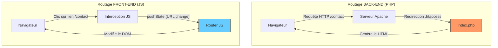

Pour conclure ce module, voici un tableau et un schéma comparatifs. L'objectif est de faire comprendre aux élèves que, si le **résultat** (une URL propre) est le même, le **lieu de décision** change radicalement.

### 1. Schéma Comparatif : Qui décide ?

Ce diagramme illustre la différence fondamentale de flux entre une architecture classique et une SPA.

---

### 2. Tableau des Responsabilités

| Caractéristique | Routage Back-end (PHP) | Routage Front-end (JS / SPA) |
| --- | --- | --- |
| **Point d'entrée** | Fichier physique `index.php` | Fichier physique `index.html` |
| **Chargement** | La page se recharge entièrement | La page ne se recharge **jamais** |
| **Source de l'URL** | `$_SERVER['REQUEST_URI']` | `window.location.pathname` |
| **Changement d'URL** | Via une requête au serveur | Via `history.pushState()` |
| **SEO (Référencement)** | Excellent par défaut | Nécessite des configurations (SSR) |
| **Outil de base** | Serveur (Apache/Nginx) + PHP | Navigateur (API History) + JS |

---

### 3. Synthèse pour les élèves

* **En PHP :** C'est le serveur qui est "intelligent". Il reçoit une adresse, prépare la "soupe" HTML et l'envoie toute prête au navigateur. Chaque changement d'URL est un voyage aller-retour vers le serveur.
* **En JS :** C'est le navigateur qui est "intelligent". Le serveur ne donne que l'enveloppe vide (`index.html`). Le JS s'occupe de meubler l'intérieur et de changer l'adresse sur la porte sans jamais quitter la maison.

---

### 4. Le mot de la fin : Et le PSR-7 ?

Maintenant qu'ils ont compris ce flux, vous pouvez leur dire que le **PSR-7** est simplement la version "professionnelle" et standardisée de ce qu'ils viennent de faire : un moyen propre d'encapsuler ces données (URL, Méthode, Paramètres) dans un objet robuste plutôt que de manipuler des variables globales.

**Souhaitez-vous que je vous prépare une liste de 3 petits projets "fil rouge" (un en PHP, un en JS) pour mettre tout cela en pratique ?**