# URI et URL

l'**URI** est l'identifiant d'une ressource web, tandis que l'**URL** est l'adresse de ladite ressource. Dans le web, on utilise presque toujours le terme URL par abus de langage.

## Introduction : "La boussole du Web"

Chaque jour, vous ouvrez votre navigateur, tapez une adresse et, comme par magie, une page apparaît. Vous le faites des centaines de fois par semaine. Mais vous êtes-vous déjà demandé ce qui se passe réellement quand vous validez cette adresse ?

Ce que vous voyez dans votre barre d'adresse n'est pas qu'un simple texte : c'est un **identifiant unique** et une **feuille de route**. C'est le langage universel que votre navigateur utilise pour dire à un serveur, situé parfois à l'autre bout du monde : 

*'Je cherche exactement ce fichier-là, à cet endroit précis, avec ces paramètres spécifiques.'*

Ce document vous explique les composantes d'une adresse pour comprendre ce qu'elle cache.

1. **Comment le serveur 'lit' cette adresse** pour vous envoyer la bonne page.
2. **Pourquoi certaines parties sont invisibles** pour le serveur mais cruciales pour votre navigateur.
3. **Comment nous, développeurs, pouvons manipuler ces adresses** pour créer des sites modernes, dynamiques et fluides.

## 1. Anatomie d'une URL : Les 6 composants clés

Prenons l'exemple suivant :

`https://www.monsite.fr:8080/articles/voir?id=12&lang=fr#sommaire`

### A. Le Protocole (Scheme)

**https://** www.monsite.fr:8080/articles/voir?id=12&lang=fr#sommaire
- Définit les règles de communication (protocole).
- Autres protocoles: `sftp://` pour les fichiers, `mailto:` pour les emails, `tel:` pour les téléphones...

### B. Le Domaine ou IP (Host)

https:// **www.monsite.fr** :8080/articles/voir?id=12&lang=fr#sommaire 

- Identifie le serveur sur lequel se trouve la ressource.
- Peut être un nom de domaine (ex: monsite.fr) ou une adresse IP (ex: 127.0.0.1).

### C. Le Port

https://www.monsite.fr **:8080** /articles/voir?id=12&lang=fr#sommaire 

- Définit par quelle "porte" on communqiue avec le serveur
- Le port est caché s'il correspond au port par défaut du protocole utilisé. Par défaut, c'est `80` pour le HTTP et `443` pour le HTTPS.

### D. Le Chemin (Path)

https://www.monsite.fr:8080 **/articles/voir** ?id=12&lang=fr#sommaire

- Indique l'emplacement de la ressource sur le serveur.
- C'est cette partie qui est utilisé pour le routage dans une application Web.

### E. Les Paramètres (Query String)

https://www.monsite.fr:8080/articles/voir **?id=12&lang=fr** #sommaire

- Transmet des données supplémentaires à la page.
- Commence par un `?`. Les couples clé/valeur sont séparés par un `&`.
- Dans l'exemple ci-dessus on peut identifier 2 paramètres : 
    - `id` ayant pour valeur `12`
    - `lang` ayant pour valeur `fr`
- **En PHP :** On les récupère via la superglobale `$_GET`.
- **En JS :** On les récupère via `window.location.search
` et `URLSearchParams`.

### F. L'Ancre (Fragment / Anchor)

https://www.monsite.fr:8080/articles/voir?id=12&lang=fr **#sommaire**

- Pointe vers un endroit précis **à l'intérieur** d'une page web (ex: un titre, un paragraphe...).
- C'est la seule partie de l'URL qui n'est **jamais envoyée au serveur**. Seul le navigateur l'utilise.

---

## 2. Tableau Récapitulatif

| Composant | Nom technique | Exemple | Utile pour le serveur ? |
| --- | --- | --- | --- |
| **Protocole** | Scheme | `https` | Oui |
| **Domaine** | Host | `monsite.fr` | Oui |
| **Chemin** | Path | `/articles/voir` | **Crucial pour le routage** |
| **Paramètres** | Query String | `?id=12&lang=fr` | Oui (données variables) |
| **Ancre** | Fragment | `#footer` | **Non** (Front uniquement) |
