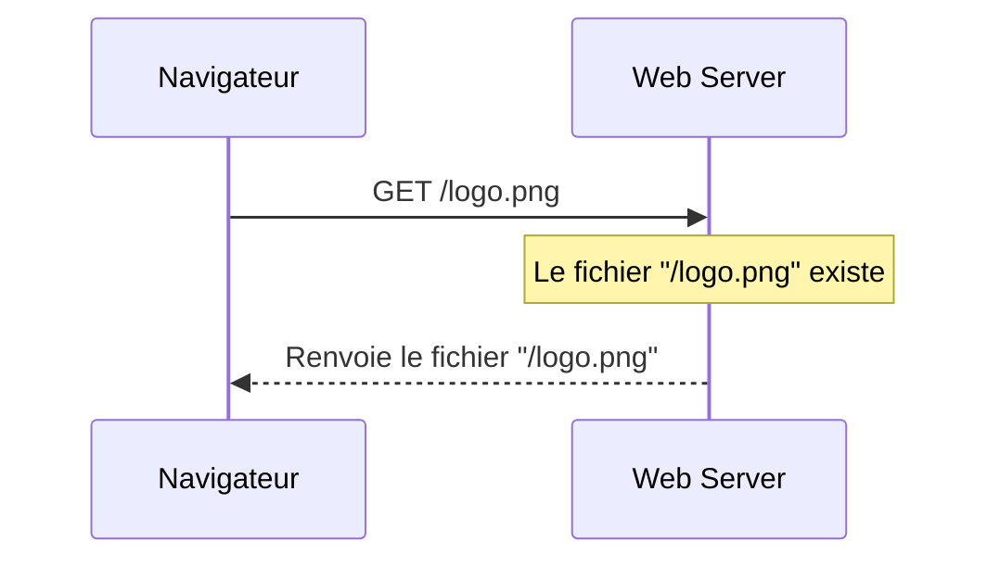
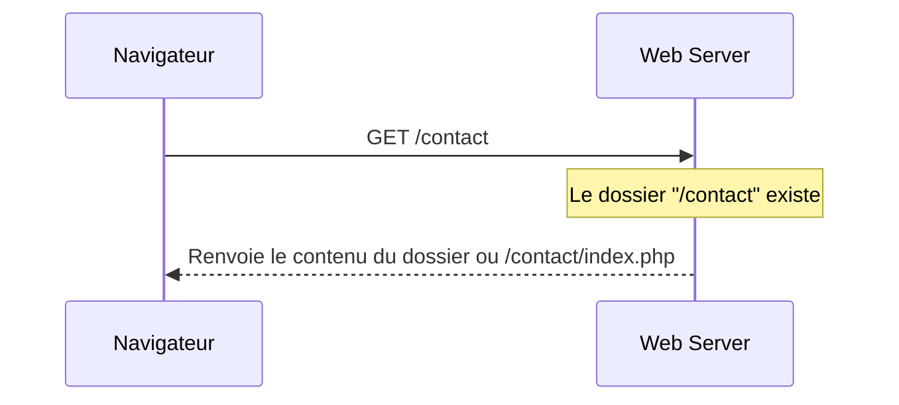
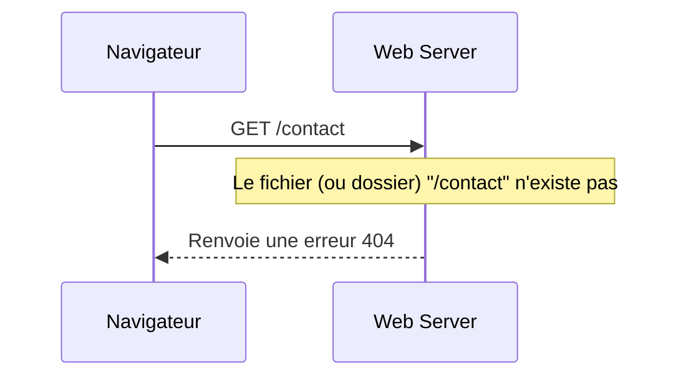
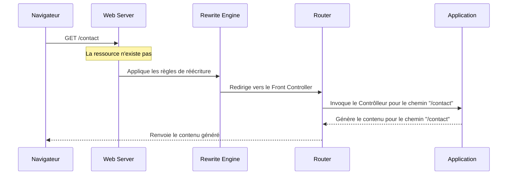
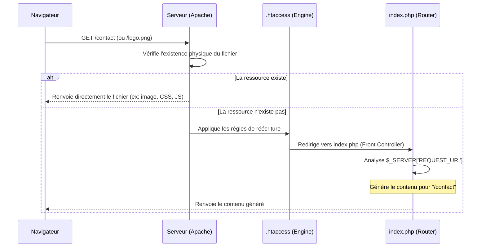

# Compréhension du flux de données : de l'URL tapée par l'utilisateur jusqu'au contrôleur.

Lorsqu'une requête HTTP est émise vers un serveur, plusieurs opérations sont effectuées. Ce document vous présente divers scénarios de requête HTTP.

# File Exists

1. Une requête HTTP est émise vers le serveur Web
2. Le serveur vérifie l'existence du fichier demandé
3. Le fichier existe
4. Le fichier est renvoyé au nvigateur ayant émis la requête

# Directory Exists

1. Une requête HTTP est émise vers le serveur Web
2. Le serveur vérifie l'existence du répertoire demandé
3. Le répertoire existe
4. Selon la configuration du serveur : 
    - Le contenu du répertoire est affiché
    - ou
    - Le fichier index.php ou index.html est renvoyé

# Not Exists

1. Une requête HTTP est émise vers le serveur Web
2. Le serveur vérifie l'existence du dossier/fichier demandé
3. Le dossier/fichier n'existe pas
4. Le serveur retourne une erreur 404 (Not Found)

# Rewrite

1. Une requête HTTP est émise vers le serveur Web
2. Le serveur vérifie l'existence du dossier/fichier demandé
3. Le dossier/fichier n'existe pas
4. Le serveur analyse et applique les règles de réécriture
5. La requête est redirigée vers un Front-Controller
6. Le Front-Controller applique ses règles de routage
7. Le contenu associé est généré
8. Le contenu généré est retourné au navigateur

## EXERCICE

Le diagramme suivant représente la séquence d'une requête émise vers un serveur Web (c'est une synthèse des 4 diagrammes précédents).

**Travail à réaliser :** 

1. Analyser le diagramme ci-dessous
2. En vous aidant des diagrammes précédents, rédiger le scénario correspondant.

### Aide 
**Le bloc "alt"** représente une structure conditionnelle "la ressource existe-t-elle ou pas ?"

**La priorité au physique :** Le serveur vérifie d'abord si le fichier existe. C'est pour cela que les fichiers statiques continuent de s'afficher sans passer par le moteur de réécriture.

**Le silence du moteur de réécriture :** L'utilisateur ne voit jamais index.php dans sa barre d'adresse. Pour lui, il est toujours sur /contact. C'est la différence entre une redirection (changement d'URL visible) et une réécriture (changement de fichier interne).

> Valider votre scénario avec un formateur
