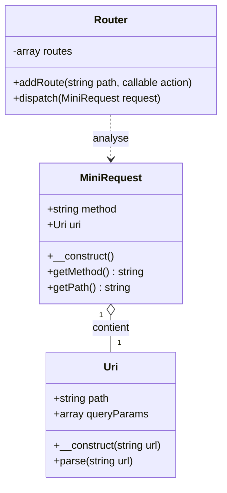
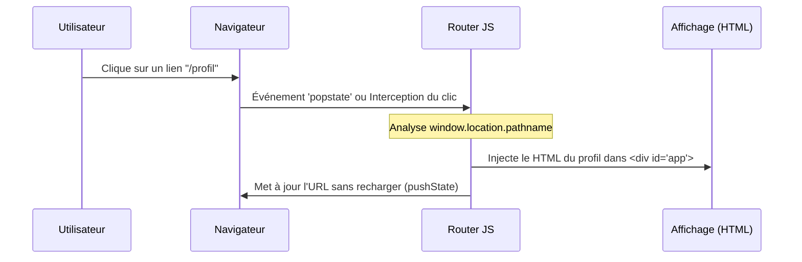
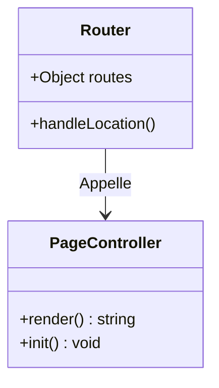

# La réécriture d'URL

Ce document présente le fonctionnement de la réécriture d'URL

- A quoi ça sert ?
- Comment le serveur réécrit les URL ?
- Comment intercepter la reqûete dans le code backend.

## La priorité au physique

Le serveur vérifie d'abord si le fichier existe. C'est pour cela que les fichiers statiques continuent de s'afficher sans passer par le moteur de réécriture.

## Le silence du moteur de réécriture

L'utilisateur ne voit jamais index.php dans sa barre d'adresse. Pour lui, il est toujours sur /contact. C'est la différence entre une redirection (changement d'URL visible) et une réécriture (changement de fichier interne).


### Le rôle du fichier .htaccess

Le fichier `.htaccess` est un fichier de configuration pour le serveur web **Apache**. Sans lui, si un utilisateur souhaite afficher `/contact`, le serveur renverra une erreur 404 si un dossier nommé "contact" sur le serveur n'existe pas.

**La réécriture d'URL** (URL Rewriting) permet de simuler une architecture de dossiers alors que tout passe par un seul point d'entrée : Le Front Controller.

Le fichier `.htaccess` se place dans le répertoire racine du serveur web (par défaut /var/www/html).

Voici un exemple de fichier `.htaccess` avec une règle de réécriture standard.

```apache
# .htaccess

# 1. Active le moteur de réécriture
RewriteEngine On

# 2. Ne pas réécrire si le fichier ou le dossier existe réellement sur le disque
# (Permet de laisser passer les images, le CSS, le JS)
RewriteCond %{REQUEST_FILENAME} !-f
RewriteCond %{REQUEST_FILENAME} !-d

# 3. Redirige tout le reste vers index.php
RewriteRule ^ index.php/$1 [L,QSA]
```

### Explications des commandes du fichier ci-dessus

- `RewriteEngine On` : Indique à Apache d'écouter les règles qui suivent.

- `RewriteCond %{REQUEST_FILENAME} !-f` : Signifie "Si le nom de fichier demandé n'existe pas physiquement (!-f)". Très utile pour que les fichiers existants s'affichent normalement sans passer par le routeur.

- `RewriteCond %{REQUEST_FILENAME} !-d` : Idem que ci-dessus pour les répertoires.

- `RewriteRule ^ index.php [L]` : C'est la règle finale. Le symbole ^ signifie "n'importe quoi". Tout est envoyé vers index.php. Le drapeau [L] (Last) dit au serveur d'arrêter de lire d'autres règles si celle-ci est appliquée. Le drapeau [QSA] (Query String Append) permet de conserver les paramètres URL (queryString) lors de la réécriture.

### Explications du drapeau [QSA]

Par défaut, lorsqu'une règle de réécriture crée de nouveaux paramètres (ceux après le **?**), elle écrase les paramètres que l'utilisateur avait éventuellement saisis dans l'URL d'origine.

Le drapeau [QSA] demande à Apache de ne pas écraser les anciens paramètres, mais de fusionner les anciens avec les nouveaux.

**Exemple concret (Le problème)**

Imaginez cette règle dans votre .htaccess :
- `RewriteRule ^produit/([0-9]+)$ index.php?id=$1 [L]`
- L'utilisateur visite : `example.com/produit/42`
- Le serveur réécrit l'url en : `index.php?id=42`
- Jusqu'ici, tout va bien

Mais...

L'utilisateur visite : `example.com/produit/42?couleur=rouge` (il veut filtrer)

Sans [QSA] :
- Le serveur reçoit `index.php?id=42`. 
- Le paramètre **couleur=rouge** est perdu.

La solution avec [QSA]

`RewriteRule ^produit/([0-9]+)$ index.php?id=$1 [L,QSA]`.

- L'utilisateur visite : `example.com/produit/42?couleur=rouge`
- Le serveur fusionne tout et reçoit : `index.php?id=42&couleur=rouge`.

Problème résolu !


### Le Front-Controller et le Routage avec PHP

Avant de coder, ils doivent comprendre qu'une URL n'est pas qu'une simple chaîne de caractères, mais un objet structuré.



### Du Navigateur au Code

Pour un débutant, il faut clarifier trois concepts clés :

- L'URI vs URL : L'URL est l'adresse complète. L'URI est l'identifiant de la ressource. Ce qui nous importe pour le routage, c'est le chemin (Path) (ex: /profil) et les paramètres (Query) (ex: ?id=5).

- La Réécriture d'URL (.htaccess) : Par défaut, Apache cherche un fichier physique. Si l'utilisateur tape /contact, Apache ne trouve pas de dossier "contact". La réécriture dit : "Peu importe ce qu'on demande, envoie tout vers index.php".

- Le Routage : C'est un simple "Aiguillage". Le code regarde le Path de la requête et décide quelle fonction exécuter (le Contrôleur).

### Le Code (Version Simplifiée)

Voici une implémentation pédagogique :

```php
<?php

// Uri.php (structure de l'URI)
class Uri {
    public string $path;
    public array $params;

    public function __construct($url) {
        $parts = parse_url($url);
        $this->path = $parts['path'] ?? '/';
        parse_str($parts['query'] ?? '', $this->params);
    }
}

// MiniRequest.php (Mini PSR-7)
class MiniRequest {
    public string $method;
    public Uri $uri;

    public function __construct() {
        $this->method = $_SERVER['REQUEST_METHOD'];
        $this->uri = new Uri($_SERVER['REQUEST_URI']);
    }
}

// Router.php
class Router {
    private array $routes = [];

    public function addRoute($path, $action) {
        $this->routes[$path] = $action;
    }

    public function dispatch(MiniRequest $request) {
        $path = $request->uri->path;
        if (isset($this->routes[$path])) {
            return $this->routes[$path]();
        }
        echo "Erreur 404 : Page non trouvée.";
    }
}

// index.php
$router = new Router();

$router->addRoute('/', function() { 
    echo "Bienvenue sur l'accueil !"; 
});
$router->addRoute('/contact', function() { 
    echo "Page de contact."; 
});

$request = new MiniRequest();

$router->dispatch($request);

```

### Explications du Code

- parse_url() : C'est la fonction magique de PHP qui découpe une chaîne comme http://site.com/blog?id=1 en un tableau associatif. C'est l'étape indispensable pour isoler le chemin.

- $_SERVER['REQUEST_URI'] : C'est la donnée brute fournie par le serveur. Elle contient tout ce qui vient après le nom de domaine.

- Le Tableau $routes : On utilise le path comme clé du tableau. Si la clé existe, on exécute la fonction (la "callback") associée.

- L'instanciation automatique : En créant $request = new MiniRequest(), on capture l'état actuel de la visite de l'utilisateur de manière propre, sans toucher aux variables globales $_GET ou $_POST partout dans le code.

# En Javascript (SPA)

Dans ce scénario, le serveur Apache ne fait qu'une seule chose : peu importe l'URL tapée, il renvoie toujours le même fichier index.html. C'est ensuite le JavaScript qui lit l'URL dans le navigateur et décide quel composant afficher.



### Explications : Les piliers du routage Front

L'API History : C'est une fonctionnalité du navigateur (window.history.pushState) qui permet de changer l'URL dans la barre d'adresse sans déclencher un rafraîchissement de la page.

L'événement popstate : Il permet de savoir quand l'utilisateur clique sur le bouton "Précédent" ou "Suivant" de son navigateur.

Le point d'ancrage : Souvent une `<div id="app"></div>` vide dans le HTML, que le JS va remplir dynamiquement.



```html
<!DOCTYPE html>
<html>
<body>
    <nav>
        <a href="/" onclick="route(event)">Accueil</a>
        <a href="/contact" onclick="route(event)">Contact</a>
    </nav>

    <div id="main-content">
        </div>

    <script src="router.js"></script>
</body>
</html>
```


```js
// Définition des "Contrôleurs" de page
const pages = {
    home: () => {
        const date = new Date().toLocaleTimeString();
        return `<h1>Accueil</h1><p>Il est actuellement ${date}</p>`;
    },
    contact: () => {
        return `
            <h1>Contact</h1>
            <form id="contact-form">
                <input type="text" placeholder="Votre nom">
                <button type="submit">Envoyer</button>
            </form>
        `;
    },
    notFound: () => "<h1>404 - Oups !</h1>"
};

// Association des chemins aux fonctions
const routes = {
    "/": pages.home,
    "/contact": pages.contact
};

const handleLocation = () => {
    const path = window.location.pathname;
    const routeAction = routes[path] || pages.notFound;
    
    // 1. On exécute la fonction pour obtenir le HTML
    const html = routeAction();
    
    // 2. On injecte le résultat dans le DOM
    const container = document.getElementById("main-content");
    container.innerHTML = html;

    // 3. Exemple d'action spécifique après l'affichage (Post-render)
    if (path === "/contact") {
        document.getElementById("contact-form").onsubmit = (e) => {
            e.preventDefault();
            alert("Formulaire envoyé !");
        };
    }
};

window.onpopstate = handleLocation;
window.route = (event) => {
    event.preventDefault();
    window.history.pushState({}, "", event.target.href);
    handleLocation();
};

handleLocation();
```


### Explications du Code

- event.preventDefault() : C'est l'étape la plus importante. Si on ne le fait pas, le navigateur essaie de charger /contact sur le serveur, ce qui casserait l'expérience SPA.

- window.history.pushState : Elle prend trois arguments (un état, un titre, et la nouvelle URL). Elle "ment" au navigateur en lui faisant croire qu'on a changé de page.

- window.location.pathname : C'est l'équivalent JS de notre $request->uri->path en PHP. C'est ici qu'on récupère ce qui est écrit après le nom de domaine.

- L'objet routes : On fait correspondre un chemin (clé) à du contenu HTML (valeur). Dans un vrai projet (React, Vue), on remplacerait le HTML par des fonctions appelant des composants.

- L'appel routeAction() : Comme routes[path] contient maintenant une référence à une fonction (ex: pages.home), on ajoute des parenthèses () pour l'exécuter et récupérer la chaîne de caractères qu'elle retourne.

- La logique dynamique : Dans pages.home, on utilise new Date(). Si vous cliquez sur "Accueil", l'heure se mettra à jour à chaque fois sans recharger la page entière.

- La gestion des événements : Dans handleLocation, on vérifie si on est sur la page /contact pour attacher un écouteur d'événement (onsubmit) au formulaire qui vient d'être créé. C'est le début de l'interactivité.
