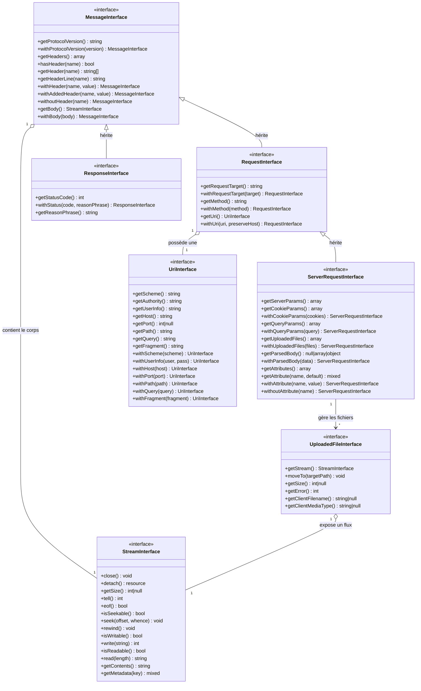

# HTTP Message Interfaces

Message / Stream (1:1) : Tout message HTTP (requête ou réponse) possède obligatoirement un corps, même si celui-ci est vide.

Request / Uri (1:1) : Une requête doit pointer vers une cible unique définie par une URI.

ServerRequest / UploadedFile (1:N) : Une requête serveur peut contenir aucun ou plusieurs fichiers envoyés via un formulaire (multipart/form-data).