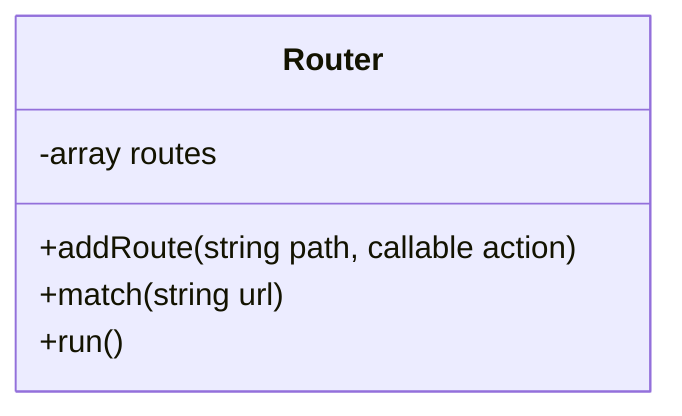
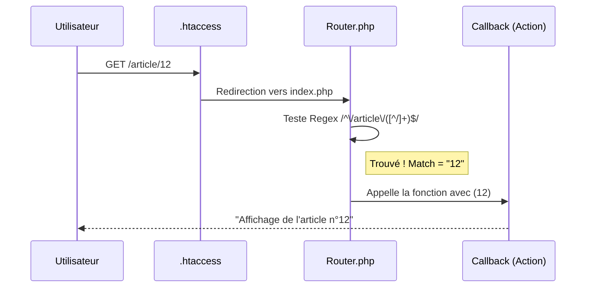

Voici le cahier des charges détaillé pour le **Projet 3 : Le "Mini-Framework"**, car c'est celui qui consolide le mieux les concepts de conception (UML), de logique serveur et d'algorithmique.

---

## 🛠️ Projet 3 : Build Your Own Router (Le Mini-Framework)

L'objectif est de créer un système de routage capable de gérer des URLs dynamiques (ex: `/article/12`) en utilisant les **Expressions Régulières**.

### 1. La Structure du Projet

Les élèves doivent organiser leurs fichiers ainsi :

* `index.php` (Le point d'entrée unique)
* `Router.php` (La classe qui contient la logique)
* `.htaccess` (La redirection Apache)

### 2. Étape par Étape : Le développement

#### Étape A : Le contrat (L'interface)

Le routeur doit permettre d'enregistrer des routes avec un "placeholder" (ex: `:id`) et de les associer à une fonction.



#### Étape B : La transformation Regex (Le défi technique)

C'est la partie la plus instructive. Les élèves doivent transformer un chemin "lisible" en expression régulière.

* **Entrée :** `/article/:id`
* **Transformation :** Remplacer `:id` par `(\d+)` et ajouter les ancres `^` et `$`.
* **Résultat :** `/^\/article\/(\d+)$/`

#### Étape C : La boucle de correspondance (Match)

Le routeur doit parcourir toutes les routes enregistrées et tester l'URL actuelle contre chaque Regex.

### 3. Le Code à implémenter (Cahier de test)

Voici le test que leur code doit réussir à la fin du TP :

```php
$router = new Router();

// Route statique
$router->addRoute('/', function() {
    echo "<h1>Bienvenue sur l'accueil</h1>";
});

// Route dynamique avec paramètre
$router->addRoute('/article/:id', function($id) {
    echo "<h1>Affichage de l'article n°$id</h1>";
});

// Route avec deux paramètres
$router->addRoute('/profil/:username/photo/:id', function($user, $imgId) {
    echo "Utilisateur : $user, Image : $imgId";
});

$router->run();

```

---

### 4. Les 3 "Boss de fin" (Bonus pour les plus rapides)

1. **Le Middleware :** Ajouter une fonction qui s'exécute *avant* le contrôleur pour vérifier si l'utilisateur est connecté.
2. **Les méthodes HTTP :** Modifier `addRoute` pour qu'elle accepte uniquement du `GET` ou du `POST`.
3. **L'Inversion de contrôle :** Faire en sorte que le contrôleur ne soit pas une fonction anonyme, mais une chaîne de caractères `"ArticleController@show"`.

---

### 5. Critères d'évaluation

* ✅ Est-ce que le `.htaccess` bloque bien l'accès aux fichiers inexistants ?
* ✅ Est-ce que l'ID est bien transmis en argument à la fonction ?
* ✅ Est-ce que le code renvoie une erreur 404 propre si aucune route ne correspond ?


# CORRECTION

Voici le corrigé complet pour la classe `Router`. C'est un excellent support pour expliquer comment on passe d'une URL "imaginaire" (`/article/:id`) à une exécution réelle via les **Expressions Régulières (Regex)**.

### 1. La Logique de Transformation (Le "Cœur" du système)

Pour que PHP comprenne que `:id` est une variable, le routeur doit effectuer une conversion interne :

1. Il prend le chemin : `/article/:id`
2. Il transforme les paramètres (commençant par `:`) en groupes de capture Regex : `([^/]+)`
3. Il ajoute les délimiteurs : `/^\/article\/([^/]+)$/`

---

### 2. Le Code Corrigé : `Router.php`

```php
<?php

class Router {
    private array $routes = [];

    /**
     * Enregistre une route
     * @param string $path Exemple: "/article/:id"
     * @param callable $action La fonction à exécuter
     */
    public function addRoute(string $path, callable $action): void {
        // On transforme le chemin en Regex
        // On remplace les ":quelquechose" par un groupe de capture ([^/]+)
        $regex = preg_replace('/:[a-zA-Z0-9]+/', '([^/]+)', $path);
        $regex = str_replace('/', '\/', $regex); // On échappe les slashs
        $regex = '/^' . $regex . '$/';           // On ajoute début et fin

        $this->routes[$regex] = $action;
    }

    /**
     * Lance le moteur de routage
     */
    public function run(): void {
        $url = $_SERVER['REQUEST_URI'] ?? '/';
        
        // On nettoie l'URL des paramètres GET (?id=12) pour le matching
        $url = parse_url($url, PHP_URL_PATH);

        foreach ($this->routes as $regex => $action) {
            if (preg_match($regex, $url, $matches)) {
                // On enlève le premier élément (l'URL complète) pour ne garder que les captures
                array_shift($matches);
                
                // On appelle la fonction avec les paramètres capturés
                return call_user_func_array($action, $matches);
            }
        }

        // Si rien n'a matché
        http_response_code(404);
        echo "<h1>404 - Page non trouvée</h1>";
    }
}

```

---

### 3. Explications des fonctions PHP utilisées

* **`preg_replace`** : Utilisé ici pour transformer automatiquement les `:id` ou `:slug` en motifs de recherche pour la Regex.
* **`preg_match`** : C'est le moteur de recherche. Il vérifie si l'URL tapée correspond au "moule" de la route. S'il y a des parenthèses `()` dans la Regex, il remplit le tableau `$matches` avec les valeurs trouvées.
* **`call_user_func_array`** : C'est une fonction très puissante. Elle permet d'appeler une fonction en lui passant un tableau d'arguments. Si `$matches` contient `['42']`, la fonction recevra `$id = 42`.

---

### 4. Rappel du flux complet (Diagramme de synthèse)



---

# CORRECTION JS

Voici la version **JavaScript** du routeur dynamique. Vous remarquerez que la logique est quasi identique à celle de PHP, mais adaptée aux spécificités du navigateur (API History et Regex natives).

### 1. Le Code Corrigé : `Router.js`

```javascript
class Router {
    constructor() {
        this.routes = [];
        // On écoute le bouton "Précédent/Suivant" du navigateur
        window.onpopstate = () => this.run();
    }

    /**
     * Enregistre une route
     * @param {string} path Exemple: "/article/:id"
     * @param {function} action La fonction à exécuter
     */
    addRoute(path, action) {
        // Transformation du chemin en Expression Régulière
        // On remplace ":quelquechose" par un groupe de capture ([^/]+)
        let regexPath = path.replace(/:[a-zA-Z0-9]+/g, "([^/]+)");
        
        // On crée l'objet Regex (avec ^ et $ pour une correspondance exacte)
        const regex = new RegExp(`^${regexPath}$`);

        this.routes.push({ regex, action });
    }

    /**
     * Navigue vers une nouvelle URL sans recharger
     */
    navigateTo(url) {
        window.history.pushState({}, "", url);
        this.run();
    }

    /**
     * Analyse l'URL actuelle et exécute la bonne action
     */
    run() {
        const currentPath = window.location.pathname;

        // On cherche une route qui match
        for (let route of this.routes) {
            const match = currentPath.match(route.regex);

            if (match) {
                // match[0] est l'URL complète, les suivants sont nos captures (ex: id)
                const params = match.slice(1);
                return route.action(...params); // On "étale" le tableau d'arguments
            }
        }

        // Si aucune route ne correspond
        document.getElementById("app").innerHTML = "<h1>404 - Not Found</h1>";
    }
}

```

---

### 2. Comparaison des Syntaxes (Aide au cours)

Il est très formateur pour les élèves de comparer les deux approches :

| Fonctionnalité | PHP (Back-end) | JavaScript (Front-end) |
| --- | --- | --- |
| **Création Regex** | `preg_replace` / `str_replace` | `path.replace` / `new RegExp()` |
| **Test de l'URL** | `preg_match($regex, $url, $matches)` | `url.match(regex)` |
| **Passage d'arguments** | `call_user_func_array($action, $params)` | `action(...params)` (Spread Operator) |
| **Source de l'URL** | `$_SERVER['REQUEST_URI']` | `window.location.pathname` |

---

### 3. Exemple d'utilisation (Le "Main")

Pour que cela fonctionne, les liens HTML doivent utiliser `MapsTo` au lieu de recharger la page.

```javascript
const router = new Router();

router.addRoute("/", () => {
    document.getElementById("app").innerHTML = "<h1>Accueil</h1>";
});

router.addRoute("/article/:id", (id) => {
    document.getElementById("app").innerHTML = `<h1>Article n°${id}</h1>`;
});

// Au chargement initial
router.run();

// Intercepter les clics sur les liens
document.addEventListener("click", (e) => {
    if (e.target.tagName === "A") {
        e.preventDefault();
        router.navigateTo(e.target.getAttribute("href"));
    }
});

```

---

### 4. Conclusion du module

Vos élèves ont maintenant une vision complète :

1. **L'URI** est découpée.
2. **Le Serveur** (ou le JS) l'analyse.
3. **La Regex** capture les variables.
4. **Le Contrôleur** (la fonction) reçoit ces variables pour afficher le bon contenu.


# AUTO EVALUATION

Voici une **grille d'auto-évaluation** conçue pour aider vos élèves à mesurer leur progression sur le routage. Ils peuvent l'utiliser à la fin de leur TP pour vérifier si leurs acquis sont solides.

---

### 📊 Grille d'Auto-Évaluation : "Je maîtrise mon routeur"

| Objectif pédagogique | Je maîtrise | Je dois revoir |
| --- | --- | --- |
| Je sais expliquer la différence entre un **Path** et une **Query String**. | [ ] | [ ] |
| Je sais pourquoi on utilise un `.htaccess` (ou `index.html`) pour une SPA. | [ ] | [ ] |
| Je sais transformer une URL fixe `/contact` en Regex. | [ ] | [ ] |
| Je sais capturer un ID dynamique avec `(\d+)` en PHP ou JS. | [ ] | [ ] |
| Je sais pourquoi l'ancre (`#`) ne va jamais au serveur. | [ ] | [ ] |
| Je sais utiliser `pushState` (JS) ou `$_SERVER` (PHP) pour lire l'URL. | [ ] | [ ] |

---

### 🧠 Quiz de fin de parcours (Auto-correction)

Pour chaque question, vérifiez si vous avez compris le "pourquoi" derrière la technique :

1. **Pourquoi ma page blanche sur `/produit/5` ?** * *Indice :* Regardez votre Regex. Est-ce qu'elle accepte bien les chiffres ? Est-ce que votre `.htaccess` envoie bien la requête vers le point d'entrée ?
2. **Comment tester mon routeur sans casser mon site ?**
* *Indice :* Utilisez des `console.log` (en JS) ou des `var_dump` (en PHP) sur votre variable `$path` ou `location.pathname` juste avant le `match`.


3. **Pourquoi mon CSS disparaît quand j'active le routeur ?**
* *Indice :* Relisez la condition `RewriteCond %{REQUEST_FILENAME} !-f`. Le serveur essaie probablement de router votre fichier `.css` vers votre `index.php`.


---

### 💡 Le dernier conseil de l'enseignant

Si vous arrivez à expliquer ces concepts à un camarade de classe sans regarder vos notes, c'est que vous avez **maîtrisé le sujet**. Le routage est le "système nerveux" de vos applications : une fois compris, vous pouvez apprendre n'importe quel framework (Symfony, Laravel, React Router, Vue Router) en un temps record.

# BADGE 

C'est une excellente idée pour valoriser leur travail. Voici un modèle de badge que vous pouvez leur imprimer ou qu'ils peuvent intégrer dans le `README.md` de leur projet final.

---

### 🏅 Badge de Certification : "Maître du Routage"

> ### **COMPÉTENCE VALIDÉE : ARCHITECTURE WEB**
> 
> 
> ---
> 
> 
> **Détenteur :** [Nom de l'étudiant]
> **Projet :** "Le Mini-Framework"
> *Ce badge certifie que l'étudiant maîtrise les fondamentaux du web :*
> * ✅ **Réécriture d'URL** (Apache/.htaccess)
> * ✅ **Analyse d'URI** (Path, Query, Fragments)
> * ✅ **Routage Dynamique** (Expressions Régulières / Regex)
> * ✅ **Architecture Front-end/Back-end** (Front Controller)
> 
> 
> ## *« Le code n'est pas seulement du texte, c'est une logique qui dirige le flux. »*
> 
> 

---

### 💡 Un dernier petit coup de pouce pour votre classe

Pour clore ce module, je vous suggère de leur laisser ce **"Top 3 des erreurs de débutant"** à afficher au tableau. Cela leur évitera bien des cheveux gris lors de leurs prochains projets :

1. **L'oubli du `RewriteCond**` : Le classique. Le serveur essaie de traiter vos images et fichiers CSS comme des routes, et tout finit en 404.
2. **La confusion entre `REQUEST_URI` et `SCRIPT_NAME**` : Apprenez-leur à faire un `print_r($_SERVER)` pour voir ce que le serveur contient réellement.
3. **L'oubli du `preventDefault()` en JS** : Si le navigateur recharge la page, votre routeur est court-circuité. C'est la règle d'or des SPA.

**Bravo pour cette approche pédagogique !** C'est une base solide qui leur servira pour toute leur carrière de développeurs. Avez-vous besoin d'autre chose pour accompagner vos élèves ou souhaitez-vous clôturer ce module sur cette note positive ?